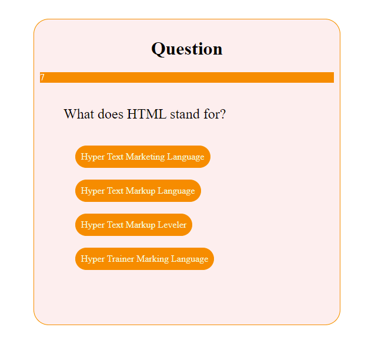
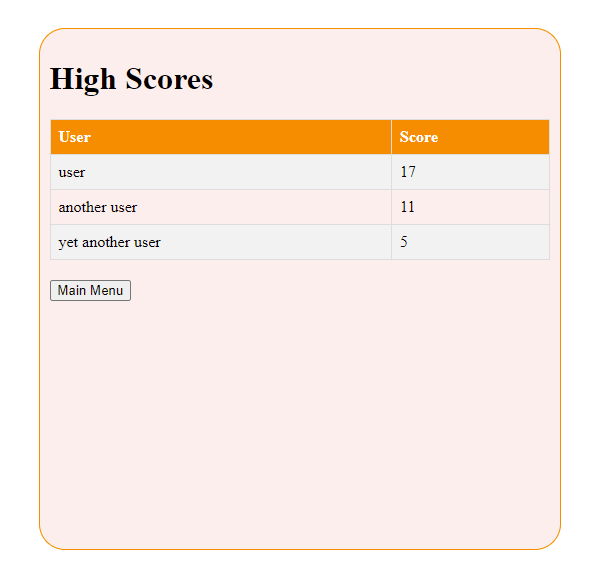

# Code Quiz
A [quiz game](https://jsardinas.github.io/code-quiz/) to practice your coding knolwedge.

##Getting Started
This is a simple game. Click `Start Quiz!` to begin answering questions. Each question is presented with four possible answers. A timer is set at the beginning of the game and each wrong answer will deduct from the remaining amount, so think carefully before answering. The game will keep count of the right answers so you have achance to win a place in the High Scores table.

## Implementation
The html file contains only a main area where the game takes place. All views are created in JavaScript and are added to or removed from the DOM as needed.

#### Questions
Each question is picked at random from a pre determined set. For each question, the position of the right answer is random and the wrong answers are also picked at random from a (posibly larger) set of wrong answers.
